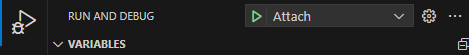

# Contributing

Any and all contributions are entirely welcomed! Before you contribute though, there are
some things you should know.

> [!NOTE]
> Making public contributions to this repo means you accept the [LICENSE](LICENSE) agreement and you're contributing code that also respects the [LICENSE](LICENSE) agreement.

## Getting started

Make sure you've given the [source code](src/) a solid read before moving forward, such that you understand the design behind **bs**.

### Building

There are two components you can use during development:

- The dev CLI
- The released (prod) CLI

#### Dev CLI

The dev CLI uses ts-node to run the source files directly.

```sh
pnpm dev --help
```

If you're quickly iterating on files, the dev CLI may be quicker
and preferable.

#### Prod CLI

The prod CLI is the final version of the CLI that gets used outside
of bs.

Use the `build` command to build the source files.

```sh
pnpm build
```

And then invoke the prod cli with the `prod` command.

```sh
pnpm prod --help
```

You can also use the `reprod` command to automatically
build the prod files before running the command.

```sh
pnpm reprod --help
```

> [!TIP]
>
> If you're running into issues with the CLI saying
> your command doesn't exist- you may want to delete the
> [oclif-manifest.json](oclif.manifest.json) file.
>
> The CLI will be slower to startup, but it'll allow
> you to add additional features before you regenerate
> it.

### Debugging

You can use the [VSCode launch configuration](/.vscode/launch.json) to launch a local
debugger with breakpoint support.

> [!WARNING]
>
> Due to a [bug in oclif](https://github.com/oclif/core/issues/1249), you may
> need to temporarily delete your `oclif.manifest.json` file while debugging.

#### Individual commands

If you're testing a single command with the same arguments, you can
modify the "launch" request in the configuration files:

```json
{
  "type": "node",
  "request": "launch",
  "name": "Execute Command",
  "skipFiles": ["<node_internals>/**"],
  "runtimeExecutable": "node",
  "runtimeArgs": ["--loader", "ts-node/esm", "--no-warnings=ExperimentalWarning"],
  "program": "${workspaceFolder}/bin/dev.js",
  "args": ["hello:world"]
}
```

And then use the "Execute Command" configuration in VSCode


#### Dynamic commands

If you're testing multiple command, or a variety of arguments on an individual
command, you can use the "Attach" configuration in VSCode.



And then run the dev CLI with your arguments in the terminal.

```sh
pnpm dev hello:world
```

> [!NOTE]
>
> The VSCode attach configuration times out after 1 minute,
> so make sure you run your command in the terminal before then.

## Making changes

To make changes, clone the repo to your local disk.

`git clone git@github.com:daymxn/bs-cli.git`

Then, checkout to a new feature branch named whatever you want it to be.

`git checkout -b SOME_BRANCH_NAME`

After you've made changes to your local branch, and you want to submit, you can open a Pull Request (PR)
via the [GitHub web panel](https://github.com/daymxn/bs-cli/compare).

### Code Formatting

Code in this repo is formatted according to eslint and prettier.
You can use the attached `.vscode` folder for automatically formatting on file save,
or you can manually run either via the command line with the `format` and `lint` scripts.

```sh
pnpm format
```

```sh
pnpm lint
```

### Updating commands

If you're adding a command, or updating an existing one, and want to update the [commands](command.md) file,
you can run the `readme` command.

```sh
pnpm readme
```

This will automatically update the file for you.

### Updating manifest

If you've made changes that affect the `oclif.manifest.json` file, you can use the
`manifest` command to automatically update it.

```sh
pnpm manifest
```

Alternatively, you can use the `update` command to automatically re-build, update
the readme, and update the manifest- all at once.

```sh
pnpm run update
```

### Changesets

We use [changesets](https://github.com/changesets/changesets) for our release notes and version bumping.

When submitting a change that should be apart of a release, you
can run the `change` command.

```sh
pnpm change
```

It will prompt you with options for setting the message and version type.

> [!IMPORTANT]
> If your change impacts the public API, ensure you're choosing the appropriate version type (according to [semver](https://semver.org/)).
>
> Alternatively, just follow the given table:
>
> `major` = Removes something from the public api, or changes the behavior of something in a breaking manner.
>
> `minor` = Adds to the public api.
>
> `patch` = Fixes a bug. The bug fix must be done in a non breaking manner, other-wise it's a major change.

#### Additional Commands

You can check out the help section of `changeset` to see a list of available commands.

```sh
pnpm changeset --help
```

### Releasing

To invoke a release, you'll need to pull the `main` branch
and run the `change version` command.

```sh
pnpm change:version
```

This will automatically bump the releasing projects.

After merging these changes back into `main`, you can move forward
with the actual publishing.

```sh
pnpm publish
```

This will publish the releasing projects to npm, with the generated changelogs.

Finally, push the git tags for the release to the repo.

```sh
pnpm push:tags
```
