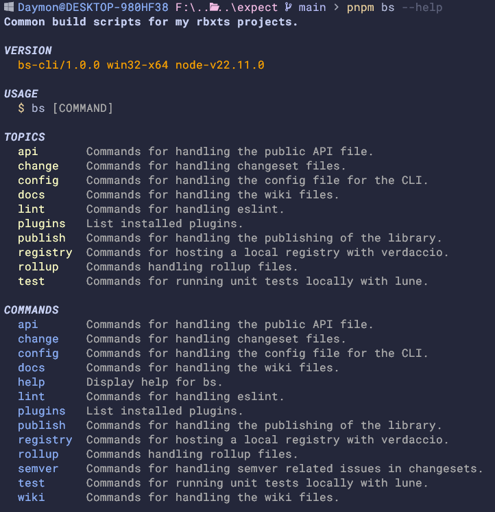

<h1 align="center">
bs
</h1>

> Common build scripts for my rbxts projects.

## Demo



## Installation

Since `bs` isn't publish to npm directly, you'll have to pull it from this repo.

```sh
pnpm add -D daymxn/bs-cli
```

You may also want to create a config file to customize a variety of default
behavior.

```sh
pnpm bs config init
```

> [!NOTE]
>
> You can use whatever package manager you want, but `bs`
> uses `pnpm` for most of its commands- so it's expected
> that you have pnpm installed.
>
> Some features may not work correctly against other
> package managers as well.

## Overview

I've been working on a lot of rbxts projects lately, and I found myself
copy and pasting a lot of the same files (eg; testing).

Furthermore, the "scripts" section of `package.json` was getting *execcively*
long, and it was hard to see the commands at a glance.

By abstracting all my scripts into a single CLI, I'm now able to not only
centralize all my common build scripts- but organize them and provide
more robust functionality.

## Commands

For a full list of commands, check out the [commands](commands.md) page.

## Roadmap

- Theme command
- Wiki commands
- Semver commands

## Contributing

If you're interested in contributing to **bs**, give the [CONTRIBUTING](CONTRIBUTING.md) doc a read.

## Licence

[Apache 2.0](LICENSE)
